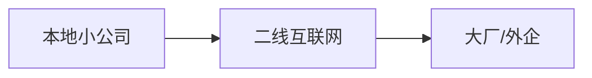

# **双非计算机大学生如何提高核心竞争力**？

> 本文作者：[程序员小白条](https://github.com/luoye6)
>
> 本站地址：[https://xbt.xiaobaitiao.top](https://xbt.xiaobaitiao.top)

### **一、技术能力：构建差异化技术栈**

建议：参与真实项目开发，考虑 Gitee 和 Github 的提交相关 Issue 和 Commite。

**关键指标**：GitHub Stars≥500 / 项目日活≥1000

开源项目：建议从大一大二开始做起，项目运营需要时间，而且技术栈前后端都要学习，包括运维方面的部分了解。

### **二、学历短板：用证书和竞赛弥补**

普通大学生：四六级、驾驶证、普通话、计算机等级考试，这些可有可无，最有用的应该是前两项，但英语实际工作比较考验口语，如果可以考雅思6.5及以上，那么英语+某个专业性工作的结合，薪资是蛮不错的，而且很多地方都会有，大小城市，乃至县镇。

牛皮大学生：高含金量竞赛如下

- **ACM-ICPC**（算法岗敲门砖）
- **全国大学生信息安全竞赛**（直通360/绿盟）
- **Kaggle比赛**（前10%可写进简历）

蓝桥杯这种可以去玩玩，如果能进国赛二等奖及以上，也是可以的，省赛的话报名就有奖(doge)

### **三、实习策略：曲线救国路径**

一般都是线下实习，优先选择离学校近的，不用租房，先赚赚钱，要求不能那么高。

远程实习岗位也有，但是比较少，我也面过，一般都是海外相关的合作，语言等技术栈要强相关。

### **四、信息差突破：掌握隐藏资源**

1.牛客（面经、内推、多认识点人不是坏事）

2.力扣算法周赛一定排名，可以获得直接面试和内推机会。

3.关注 Web3 开发的相关合约等理念，区块链等理解可了解，说不定以后就 xxx 开放了捏。

### **五、长期发展：构建抗衰老能力**

#### **1. 英语能力**

- 雅思6.5或者英语六级，建议还是考有口语的雅思，但要2000块，英语六级30块。
- 参与英文开源社区（如Kubernetes SIG组）

#### **2. 技术影响力建设**

- 坚持写技术博客（掘金/知乎≥10篇精华）
- 运营技术自媒体（B站/YouTube≥1W粉）

有其他疑问可以私信，建议是多做项目，前后端都要学习，假如自己能完全流程做一个产品，那么明显其核心竞争力是更强的，**有用的话，请给本文点个赞！转发也可！**

## 开源项目

智能 AI 旅游推荐平台：https://gitee.com/luoye6/vue3_tourism_frontend

https://github.com/luoye6/vue3_tourism_frontend

智能 AI 校园二手交易平台：https://gitee.com/luoye6/vue3_trade_frontend

https://github.com/luoye6/vue3_trade_frontend

GPT 智能图书馆：https://gitee.com/luoye6/Vue_BookManageSystem

https://github.com/luoye6/Vue_BookManageSystem

欢迎进行 Star、Fork 等支持项目！收藏即可免费领取相关项目资料，先到先得！

项目适用人群：做课设、毕设的小伙伴、只学习了后端（或者前端），但想要自己做项目写在简历上，这三个项目可以作为拓展点。

项目有多线程、事务管理、Redis 缓存、买票问题、线程池、大模型调用等可以写的点，而且体验会发现接口响应速度是很快的，功能也比较实用，想要参与开源项目的 Commiter 也可以提出。

